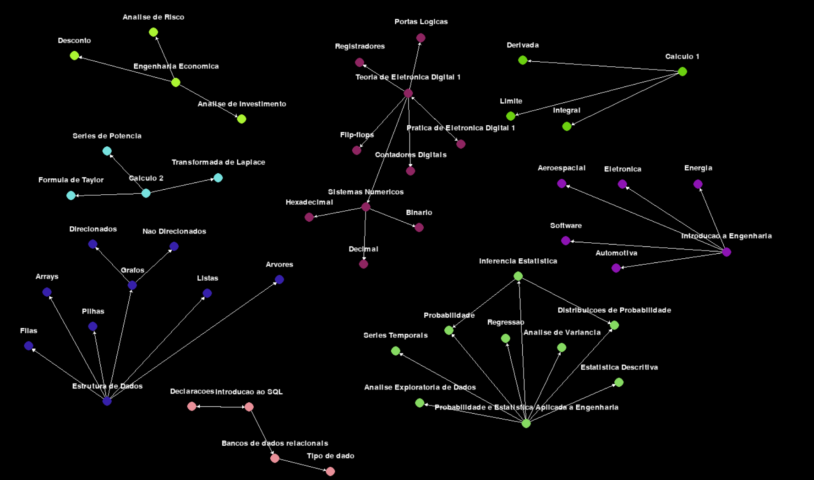
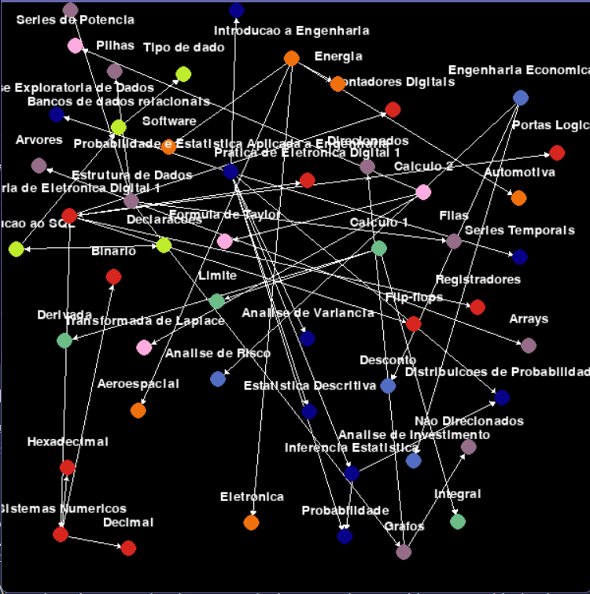
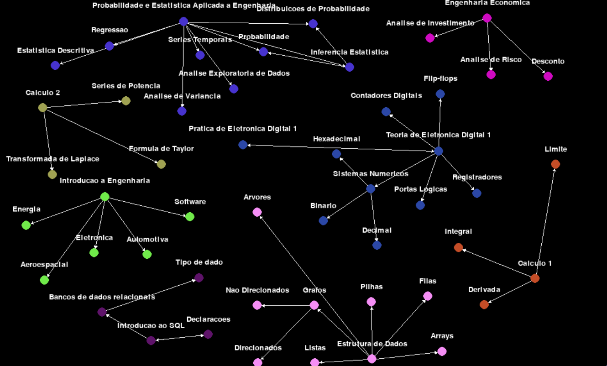

# Markdown Graph View

**Conteúdo da Disciplina**: Grafos 1<br>

## Alunos
|Matrícula | Aluno |
| -- | -- |
| 20/0041606  |  Marina Márcia Costa de Souza |
| 20/0026488  |  Rafael de Medeiros Nobre |

## Sobre 

Nosso projeto consiste em uma interface visual para visualizar anotações, em formatos de grafos. Anotações podem ser relacionadas, apontando para outras anotações, criando uma maneira de caminhar ao longo das diversas anotações. O programa ao ser executado, indetifica as anotações e seus relacionamentos, e faz o display de todas elas em um grafo interativo.

Os componentes conectados são então coloridos com a mesma cor, identificando as anotações que se relacionam.


## Screenshots



 

## Instalação 
**Linguagem**: Python 3.9 + <br>

Uma vez com o python instalado, execute o comando abaixo para instalar as dependências:

```terminal
pip install -r requirements.txt
```
## Uso 

Para isso, tenha uma pasta com seus arquivos markdown, e utilize o padrão [[FILE_NAME]] para referenciar outras notas. Por exemplo

|--Grafos.md

|-- Direcionados.md

|-- Não Direcionados.md


```markdown (Grafos.md)
Existem diversas técnicas e algoritmos para trabalhar com grafos, incluindo busca em profundidade, busca em largura,
algoritmo de Dijkstra, algoritmo de Kruskal, entre outros. Essas técnicas são úteis para resolver problemas de caminho mais curto, 
árvores geradoras mínimas, fluxo máximo, entre outros.

Os grafos podem ser [[Direcionados]]
Os grafos podem ser [[Nao Direcionados]]
```

Esta estrutura cria um link de Grafos.md para os outros dois arquivos

Para ser executado execute o comando:

```
python main.py ./arquivos_teste
```

Sendo o parâmetro './arquivos_teste' o diretório raíz em que suas anotações se encontram. Qualquer conjunto de arquivos que sigam as regras acima descritas é esperado que funcione.

## Outros 
- É crucial que os nomes de arquivos e os nomes indicados dentro do referenciador de links esteja idêntico
- Qualquer referência a um arquivo inexistente ocasionará um erro no programa


